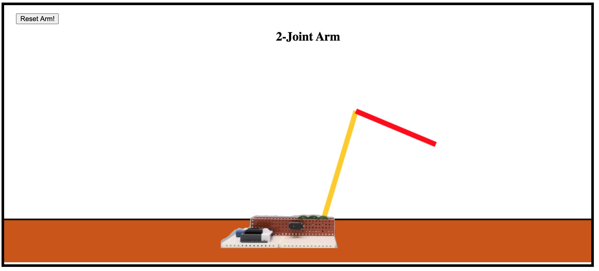

# 2-Joint Arm Simulator
Uses inverse kinematics to bend arm's joints appropriately to reach cursor. Hardware design for arm is also included to be built whenever the pandemic is over. In the meantime, I built a small web app to simulate the arm.

#### Setup
% cd TwoJointBot  
% pipenv --three install  
% pipenv run python script.py

#### Acknowledgements
Mechanical design: Aidan Miller  
Render and design schematic: Murun Tsogtkhuyag  